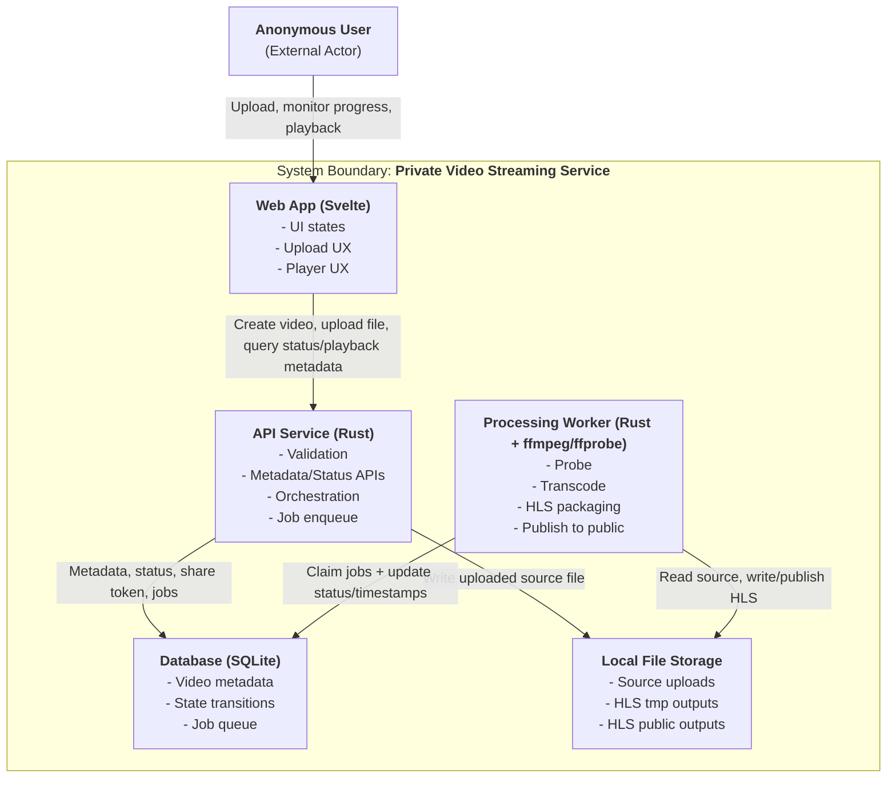

# Architecture Overview

## System Overview

This is a minimal private video streaming service. Users can upload video files anonymously — the system validates the upload, generates a shareable link immediately, and processes the video in the background into HLS format for browser playback. Anyone with the shareable link can monitor processing progress and stream the video once it is ready.

The system is designed around a single guiding objective: **minimize time-to-stream** (the time from starting a video upload until it can be streamed). Video quality is secondary — 720p with adaptive bitrate is the target, not maximum fidelity.

## System Containers

- **Web App (SvelteKit + hls.js):** Built with SvelteKit using `adapter-static` (deployed as static files). Uses hls.js for adaptive bitrate HLS playback. File-based routing handles the two app routes (`/upload` and `/s/{token}`).
- **API Service (Rust):** Validates uploads, manages video metadata and state, serves status/share endpoints, and enqueues processing jobs.
- **Processing Worker (Rust + ffmpeg/ffprobe):** Runs as a separate process. Probes source files, transcodes to multi-rendition HLS, and publishes output to the public media directory.
- **Database (SQLite):** Stores video metadata, state transitions, and the job queue. No separate database server needed.
- **Local File Storage:** Stores uploaded source files and HLS output (tmp and public directories).

API and Worker coordinate asynchronously through the DB-backed job queue — there is no direct API-to-Worker call.

## Key Architecture Decisions

### Two-Step Upload (POST metadata + PUT bytes)

Upload is split into two API calls: `POST /api/videos` creates the video record and immediately returns a shareable link, then `PUT /api/videos/{id}/source` transfers the file bytes. This enables early validation, immediate share-link issuance before the upload even starts, a durable `video_id` for failure recovery, and a clean path toward future migration to direct-to-object-storage uploads (presigned URLs) without redesigning the lifecycle API.

### Asynchronous Processing via DB-Backed Job Queue

Long-running media work (probing, transcoding, publishing) is pushed to a background worker rather than handled in the API request path. The API enqueues a job and returns immediately. This keeps API responses fast, enables resilient retries with backoff, and makes processing progress visible to users via status polling. The job queue is backed by SQLite (polling-based) for MVP simplicity, designed to migrate to PostgreSQL for horizontal scaling.

### HLS with Adaptive Bitrate (720p + 360p)

HLS is the sole playback protocol. The worker produces multi-rendition output (720p + 360p, no upscaling) so the player can adapt to network conditions. This satisfies the "consistent playback regardless of file size" objective without adding protocol complexity. Segment-based delivery means playback can start before the full file is downloaded.

### ffmpeg and ffprobe for Transcoding

ffmpeg handles transcoding and HLS segment packaging. ffprobe validates source files and extracts metadata (duration, resolution, codecs). Both are mature, widely-used, open-source tools with no licensing cost — a deliberate choice for cost efficiency.

### SQLite for MVP

SQLite removes the need for a separate database server, simplifying deployment and local development. Write throughput is sufficient for MVP capacity (5 concurrent uploads, 1 worker). The tradeoff is limited concurrent write performance — the migration path is to swap in PostgreSQL when horizontal scaling is needed, without changing API contracts.

### Local File Storage for MVP

Source files and HLS output are stored on the local filesystem. This avoids cloud storage cost and configuration for the MVP. The storage layer sits behind a clear abstraction so it can be swapped for object storage (S3-compatible) with presigned URL uploads after MVP validation.

### Idempotency on Critical Transitions

Source-upload finalization (`PUT /api/videos/{id}/source`) and worker job consumption enforce strict idempotency. This makes retries safe and prevents duplicate processing. The tradeoff is additional state guards and uniqueness constraints, but it eliminates a class of failure modes that would otherwise require manual intervention.

## Time-to-Stream Optimization

Every major decision is shaped by the goal of minimizing time-to-stream:

- **Immediate link issuance:** The shareable link is returned in the `POST /api/videos` response, before any bytes are uploaded. Users can share the link while the upload is still in progress.
- **Async processing:** The API does not block on transcoding. The upload completes, a job is enqueued, and the worker picks it up independently.
- **No blocking flows:** Progress is always visible. The share page shows upload status, processing stage, and transitions to playback automatically.
- **720p cap:** Limiting the top rendition to 720p reduces transcoding time compared to higher resolutions, directly lowering time-to-stream.
- **Source cleanup:** Source files are deleted after successful processing. No accumulation of large originals on disk.

## Cost Efficiency

The stack is designed to be cheap to run:

- **SQLite** eliminates the cost of running a separate database server.
- **Local file storage** eliminates cloud storage costs during MVP operation.
- **Rust** provides low memory and CPU overhead per request, reducing infrastructure requirements.
- **Single binary deployment** — API and worker are built from the same Rust crate and run as separate processes, minimizing operational complexity.
- **ffmpeg** is open-source with no licensing cost.

## Scaling Path

The MVP is intentionally simple (single-machine, SQLite, local storage) but designed so that scaling requires operational changes, not architectural redesign:

1. **Database:** Swap SQLite for PostgreSQL. Same schema, same queries, higher concurrent write throughput and pub/sub for job notifications.
2. **Storage:** Swap local file storage for S3-compatible object storage. Move the upload data path to direct browser-to-storage uploads via presigned URLs, removing the API server from the bandwidth path.
3. **Workers:** Increase worker process count (`WORKER_CONCURRENCY`) and tune CPU/ffmpeg thread limits per worker.
4. **API contracts remain stable** throughout these changes — the same endpoints, same state machine, same client behavior.
