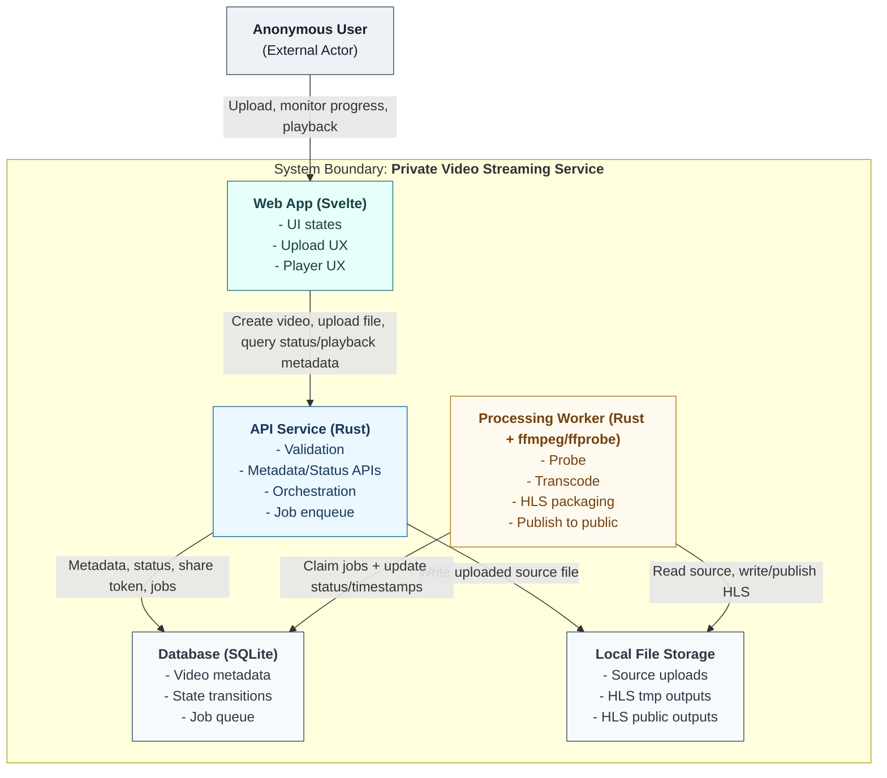

# C4 System Context and Containers

This diagram shows:
- External actors
- Containers inside the system boundary
- Direct runtime relationships between them

## Notes

- Arrows represent direct runtime interactions only.
- Request/response is represented by a single request-direction arrow for readability.
- API and Worker coordinate asynchronously through the DB-backed job queue (no direct API -> Worker call).
